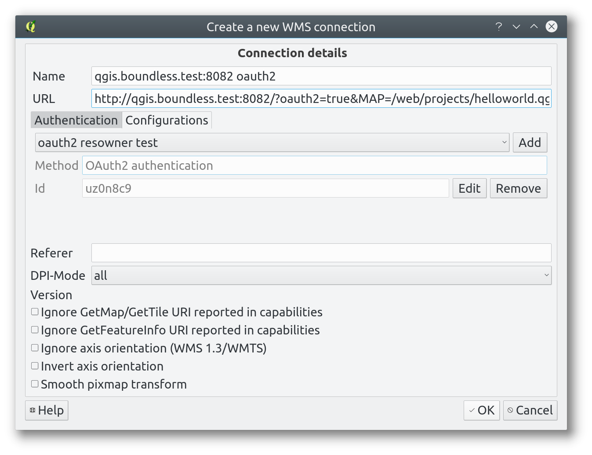

qgis-server-docker
============================

This is a simple container for testing QGIS Server, slightly inspired by:
https://github.com/kartoza/qgis-server (many thanks to Tim and Richard)

**Note** this is not intended to be used in production but only for unit/integration
testing.

# Features

Both `CGI` and `FastCGI` endpoints are provided, `CGI` is particularly useful for testing
plugins because it reloads all plugins on each request while `FastCGI` requires
apache reloading.

On the othe end, plugins that require persistence in memory must run as `FastCGI`.

**WFS-T** is enabled (no authentication required).

*QGIS Server Browser* plugin is installed by deafult for a quick preview of layers.

*Customized GetFeatureInfo* response plugin add an HTML snippet to all responses. The main purpose of this is to allow testing of hyperlinks in the GetFeatureInfo response.

*QGIS Server OAuth2* resource owner grant flow plugin is installed as a separate python wrapper script.


# Building

You can build the image with:

```
# Place your IP address here, if you want to use apt-catcher, or comment
# it out in the Dockerfile
$ export ADDR=192.168.1.1
$ docker build -t qgis-server --build-arg APT_CATCHER_IP=$ADDR .
```

# Running

To run a container, assuming that you want it available on host port 8081 (and OAuth2 on 8082) do:

```
$ docker run -p 8081:80 -p 8082:8082 -it -h qgis.boundless.test --name qgis-server qgis-server
```

You might want to mount the `/web` folder as a local volume that contains your
QGIS projects and makes logs easily accessible.


```
docker run -p 8081:80 -it --name qgis-server \
    -v <path_to_local_web_folder>::/web\
    qgis-server
```

Replace ``<path_to_local_web_folder>`` with an absolute path on your
filesystem.

To use the OAuth2 plugin, you can optionally pass the configuration in the 
environment with `-e` like in the example below:
```
docker run -d \
    -e QGIS_SERVER_OAUTH2_USERNAME=username \
    -e QGIS_SERVER_OAUTH2_PASSWORD=password \
    -e QGIS_SERVER_OAUTH2_TOKEN_EXPIRES_IN=3600 \
    -h qgis.boundless.test \
    --name qgis-server \
    elpaso/qgis-server:latest
```

### QGIS Server

In order to test OAuth2 resource owner grant flow, a Python script that relies on QGIS Server is listening on container port `8082` (mapped to host port `8083`).

**Note**: this functionality requires an hostname set in the container.

In order to connect to the OAuth2 endpoint you must pass `oauth2=true` in the URL,
for example:

(http://qgis.boundless.test:8082/oauth2=true&MAP=/web/projects/helloworld.qgs&SERVICE=WMS&REQUEST=GetCapabilities).

#### OAuth2 client configuration

- Grant type: Reosurce Owner
- Username: `username`
- Password: `password`





# Example folder structure


The `/web` example folder contains:

* the QGIS project **helloworld** with all its data

The provided example `/web` folder structure is:

```
web/
├── htdocs             # Your HTML docs
│   └── index.html
├── logs               # Server logs (apache and QGIS)
│   ├── access.log
│   ├── error.log
│   ├── qgis-cgi.log
│   └── qgis-fcgi.log
├── plugins            # Server plugins (oauth2 and simple server are installed by the install script)
│   └── getfeatureinfo    
│       ├── getfeatureinfo.py     
│       ├── __init__.py     
│       └── metadata.txt     
└── projects           # QGIS projects
    ├── helloworld.qgs
    ├── bluemarble.tiff
    ├── world.dbf
    ├── world.prj
    ├── world.qix
    ├── world.shp
    └── world.shx
```


# Endpoints


## FastCGI, example project
http://localhost:8081/cgi-bin/qgis_mapserv.fcgi?MAP=/web/projects/helloworld.qgs&SERVICE=WMS&REQUEST=GetProjectsettings
## CGI, example project
http://localhost:8081/cgi-bin/qgis_mapserv.cgi?MAP=/web/projects/helloworld.qgs&SERVICE=WMS&REQUEST=GetProjectsettings
## FastCGI example project, OAuth2 resource owner enabled
http://localhost:8082/?oauth2=true&MAP=/web/projects/helloworld.qgs&SERVICE=WMS&REQUEST=GetProjectsettings


------------------
Alessandro Pasotti
